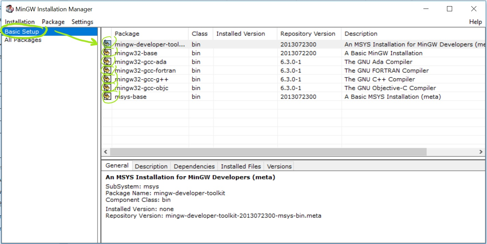
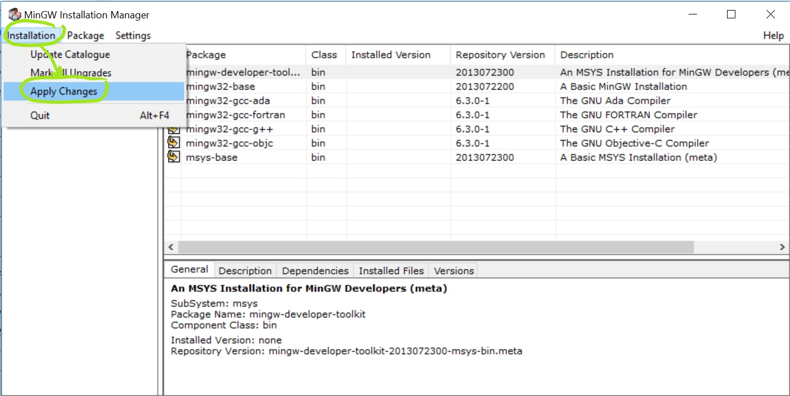
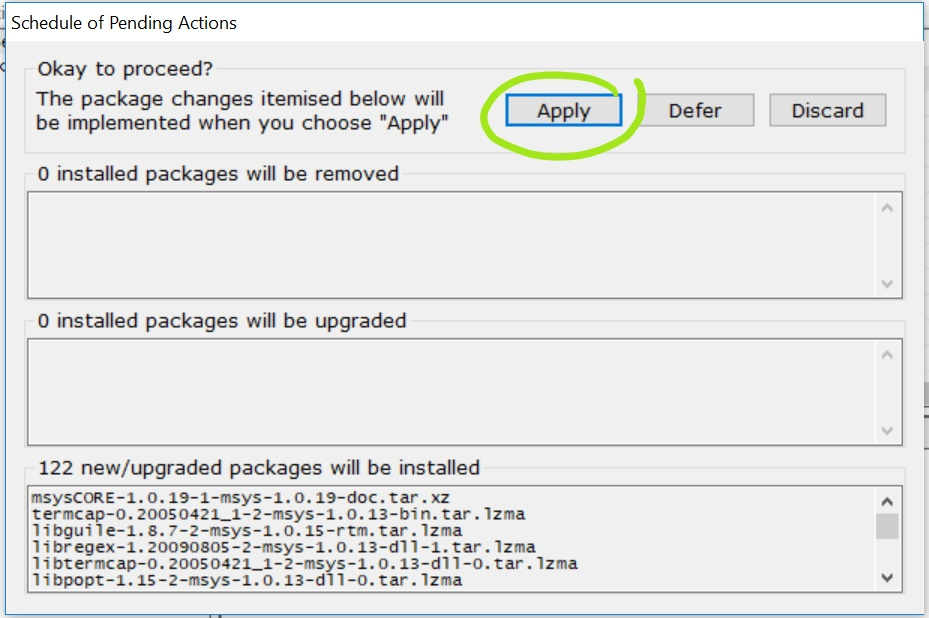
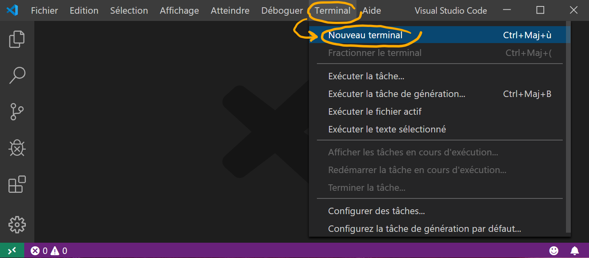
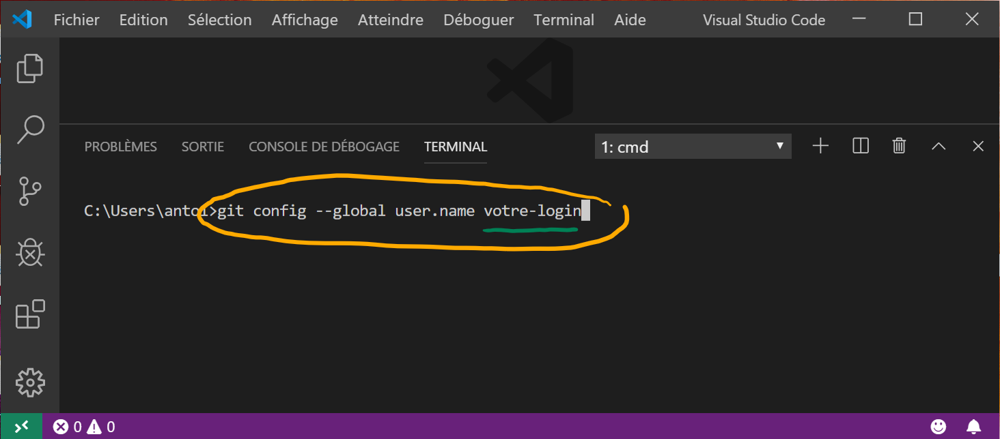
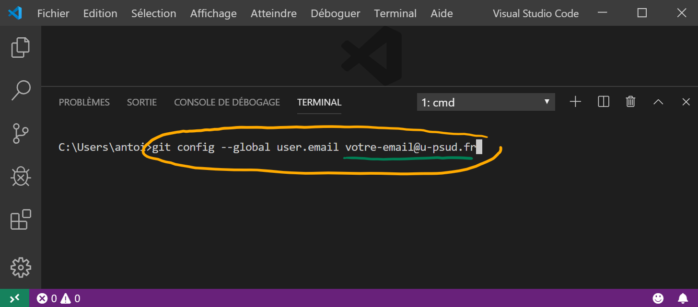

# Génie Logiciel

Dépôt pour les cours de GL à l'IUT de Cachan

## Organisation des dossiers

* Dossier `include`
* Dossier `src`

## Règles à respecter

* Avant de démarrer un __projet C et/ou C++__, vous devez avoir un __clone local__ de votre
repo.
* Chaque fichier `.h` ou `.hpp` créé doit être placé dans le dossier `include`.
* Chaque fichier `.c` ou `.cpp` créé doit être placé dans le dossier `src`.

## Par où commencer

### Comment cloner localement votre repo

* Récupérér le lien de votre repo :
    * Cliquer sur le bouton vert __Clone or download__ et copier l'URL

* Cloner avec __Visual Studio Code__ :
    * Ouvrir Visual Studio Code
    * Appuyer sur `F1`, ensuite taper `clone`, choisissez `Git: Clone`
    * Coller l'URL dans le champ demandé
    * Sauvegarder quelque part (à l'IUT, ce sera dans votre dossier qui est
    dans `C:\Travail`)
    * Cliquer sur `Open Repository`

### Branches, Commits, et Synchronisation
Pas d'explications, il faut pratiquer !

### À la maison

#### Installation des logiciels
Vous devez installer les logiciels qui vous seront utiles pour travailler à
la maison. Dans l'ordre, installer :
* [Git](https://www.git-scm.com/download)
    * __Attention :__
        * laisser le chemin d'installation par défaut `C:\Program Files\Git`
* [Visual Studio Code](https://code.visualstudio.com/download)
    * __Attention :__
        * choisir la version `User Installer - 64 bit`
* [CMake](https://cmake.org/download/)
    * __Attention :__
        * chercher `Windows win64-x64 Installer`
        * laisser le chemin d'installation par défaut `C:\Program Files\CMake`
* [MinGW](https://sourceforge.net/projects/mingw/) 
    * __Attention :__
        * laisser le chemin d'installation par défaut `C:\MinGW`
        * veuillez suivre les captures d'écran ci-dessous pour
        installer proprement MinGW
  
  
  

#### Modification des variables d'environnement sous Windows
* Taper _variables d'environnement_ sur le bouton _Démarrer_ puis
cliquer sur `Modifier les variables d'environnement système`
* Cliquer sur le bouton `Variables d'environnement ...`
* Dans le champ **_Variables système_**, sélectionner la variable `Path` puis
cliquer sur `Modifier ...`
* Ajouter le chemin vers **_MinGW_** qui est `C:\MinGW\bin` en cliquant
successivement sur `Nouveau` et sur `Parcourir ...`
* Cliquer `OK`

#### Installation des extensions dans _Visual Studio Code_
* Redémarrer _Visual Studio Code_
* Cloner votre repo
* Accepter toutes les requêtes d'installation d'extensions de
_Visual Studio Code_

#### Paramétrage du versionning dans _Visual Studio Code_
* Redémarrer _Visual Studio Code_
* Suivre les captures d'écran ci-dessous pour paramétrer vos
identifiants sur _Visual Studio Code_
  
  
  

